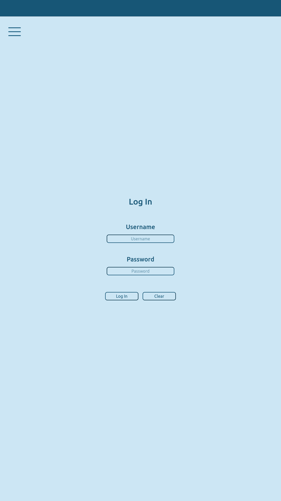
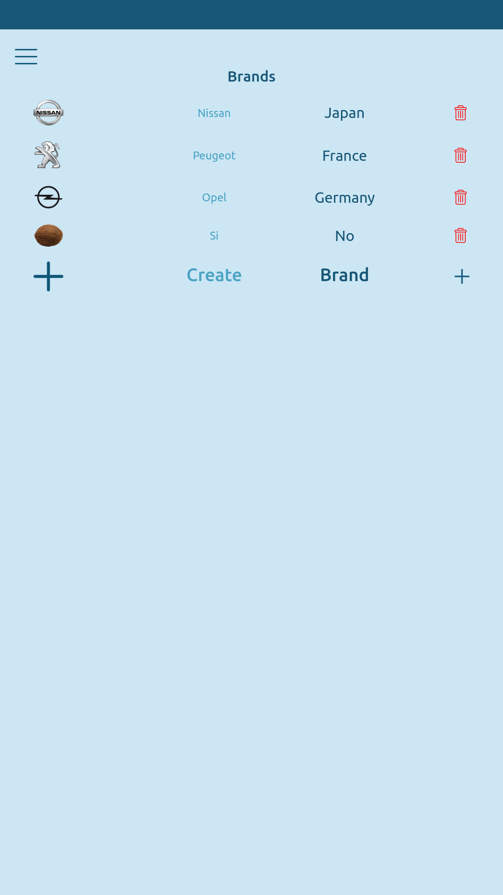
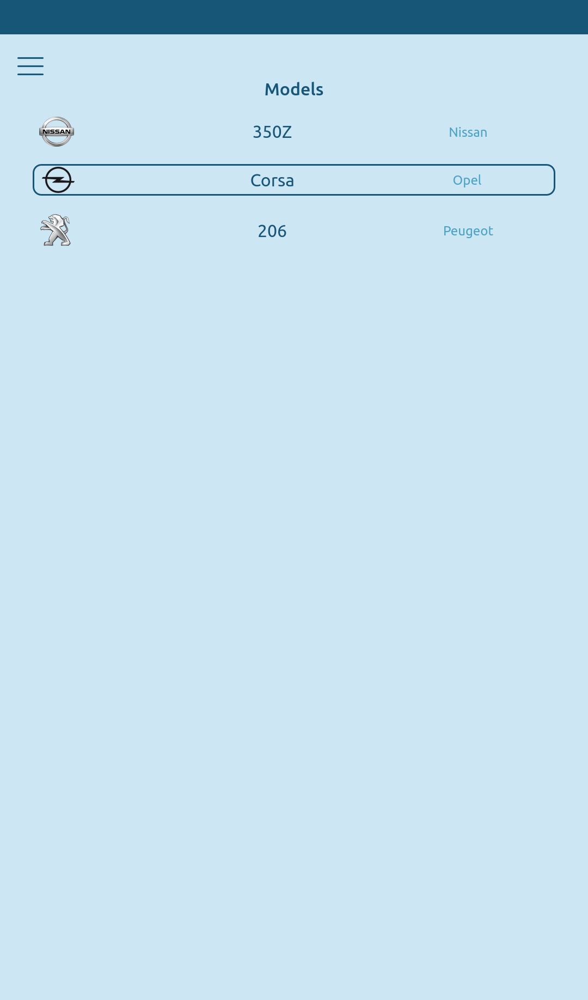
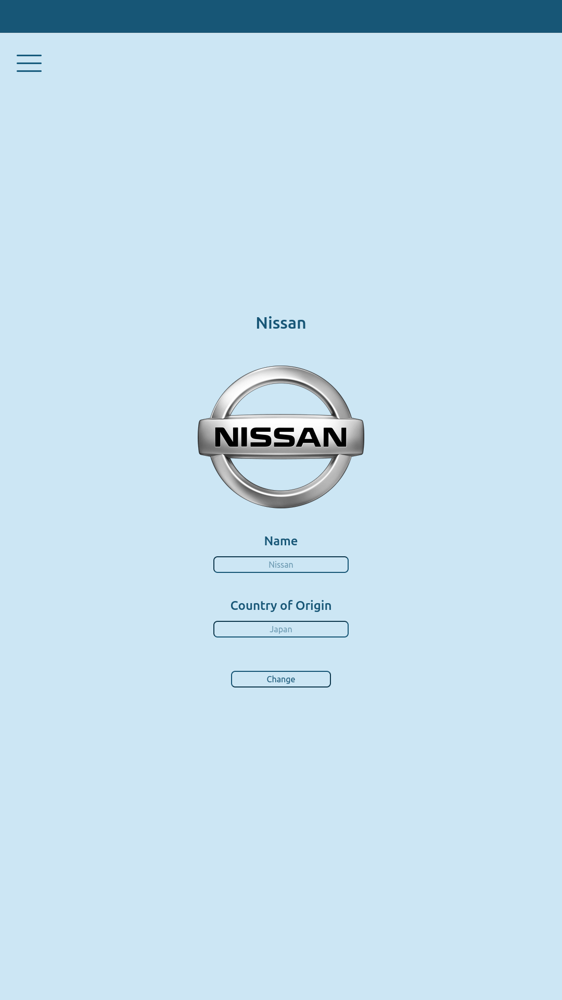
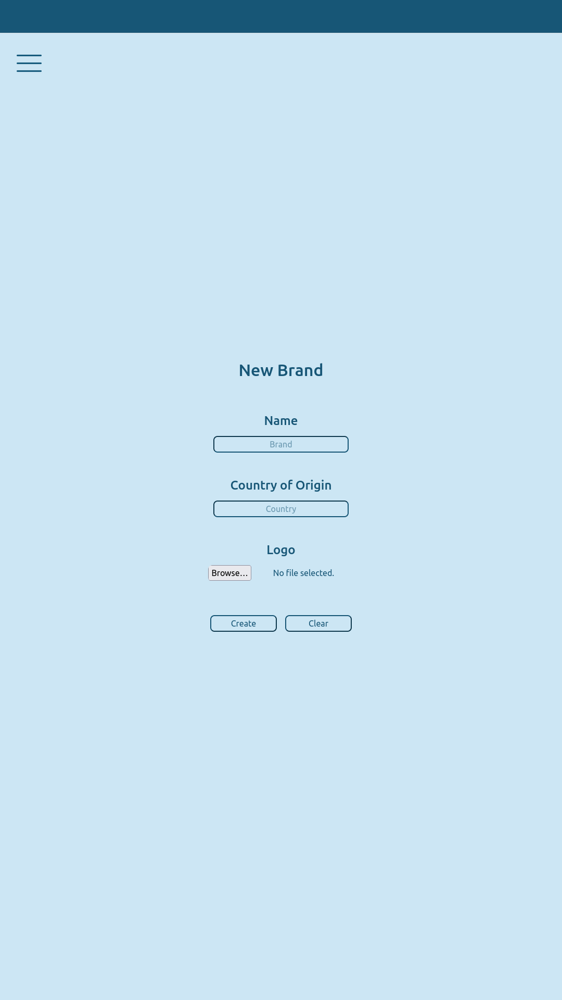

# Disclaimer

This project was prepared in conjunction with a [BackEnd API](https://github.com/KRodVal/CarListApi) built in Ruby on Rails. 
To access the directory where said backend is stored, please click [here](https://github.com/KRodVal/CarListApi).

Before starting the Instalation Guide, you must have installed [Node.JS](https://nodejs.org/es/), as it comes with npm (Node.JS' package manager).

# Instalation Guide an Quick Guide

In this section, you'll find everything needed to set this project running.

## Getting Started with Create React App

This project was bootstrapped with [Create React App](https://github.com/facebook/create-react-app).

### Available Scripts

In the project directory, you can run:

#### `npm start`

Runs the app in the development mode.\
Open [http://localhost:4000](http://localhost:4000) to view it in your browser.

The page will reload when you make changes.\
You may also see any lint errors in the console.

#### `npm test`

Launches the test runner in the interactive watch mode.\
See the section about [running tests](https://facebook.github.io/create-react-app/docs/running-tests) for more information.

#### `npm run build`

Builds the app for production to the `build` folder.\
It correctly bundles React in production mode and optimizes the build for the best performance.

The build is minified and the filenames include the hashes.\
Your app is ready to be deployed!

See the section about [deployment](https://facebook.github.io/create-react-app/docs/deployment) for more information.

#### `npm run eject`

**Note: this is a one-way operation. Once you `eject`, you can't go back!**

If you aren't satisfied with the build tool and configuration choices, you can `eject` at any time. This command will remove the single build dependency from your project.

Instead, it will copy all the configuration files and the transitive dependencies (webpack, Babel, ESLint, etc) right into your project so you have full control over them. All of the commands except `eject` will still work, but they will point to the copied scripts so you can tweak them. At this point you're on your own.

You don't have to ever use `eject`. The curated feature set is suitable for small and middle deployments, and you shouldn't feel obligated to use this feature. However we understand that this tool wouldn't be useful if you couldn't customize it when you are ready for it.

### Learn More

You can learn more in the [Create React App documentation](https://facebook.github.io/create-react-app/docs/getting-started).

To learn React, check out the [React documentation](https://reactjs.org/).

#### Code Splitting

This section has moved here: [https://facebook.github.io/create-react-app/docs/code-splitting](https://facebook.github.io/create-react-app/docs/code-splitting)

#### Analyzing the Bundle Size

This section has moved here: [https://facebook.github.io/create-react-app/docs/analyzing-the-bundle-size](https://facebook.github.io/create-react-app/docs/analyzing-the-bundle-size)

#### Making a Progressive Web App

This section has moved here: [https://facebook.github.io/create-react-app/docs/making-a-progressive-web-app](https://facebook.github.io/create-react-app/docs/making-a-progressive-web-app)

#### Advanced Configuration

This section has moved here: [https://facebook.github.io/create-react-app/docs/advanced-configuration](https://facebook.github.io/create-react-app/docs/advanced-configuration)

#### Deployment

This section has moved here: [https://facebook.github.io/create-react-app/docs/deployment](https://facebook.github.io/create-react-app/docs/deployment)

#### `npm run build` fails to minify


This section has moved here: [https://facebook.github.io/create-react-app/docs/troubleshooting#npm-run-build-fails-to-minify](https://facebook.github.io/create-react-app/docs/troubleshooting#npm-run-build-fails-to-minify)

## After running the app

Right after you start the frontend, you'll be redirected to the page, in which the first thing that will appear it's the `Log In` page.

### Log In

The Log In is a must if you want to make good use of the clean and sleek design of the body.

To Log yourself in, you just need to write down an existing username and it's password, the page will manage the token by itself.

### Main Page

Once logged, you will be redirected to the `/brands`, showing you all of the brands listed on the API. 
You can click on each brand to modify it's name or country of origin for example.

If you think there's not enough brands or maybe you want to see one in particular, the last option listed is your choice.

The `Create Brand` card leads to a new section, in which you can add a new brand to the API, the `/brands/create`.
But we'll talk about create in a second.

### OffCanvas

On the top left corner you might notice the typical hamburger menu, well, in this case it will open up the offcanvas, which it's used as a basic navigation bar.

Once the navbar is deployed, you may see some options inside it, like the user image up on the right side, or the navigation buttons right in the middle.

Here, we can travel right into the `/models` section, in which we'll see every model just as we saw the brands, but in this case, we will be displayed the model name along its brand and logo.

### Create

We can send a new brand onto our API by just going back to the `/brands/create` section, but if for any reason we haven't logged in because we don't have our own user, we can create it in `/signup`.

The process is simple, we just need to fill the form with our username, password and age.

### Delete

In case you find a new entry that doesn't match with any existing brand, there's a red button just at the right side of the card.

There's no need to further explain what it does.

## 
## API Reference

#### Brands

```http
 GET  /brands
```

| Parameter | Type     | Description                |
| :-------- | :------- | :------------------------- |
| `Token`   | `string` | **Required**. Your Token   |

#### Brand

```http
  GET /brands/${id}
```

| Parameter | Type     | Description                       |
| :-------- | :------- | :-------------------------------- |
| `id`      | `string` | **Required**. Id of brand to fetch |
| `Token`   | `string` | **Required**. Your Token          |

#### Brands

```http
 GET  /models
```

| Parameter | Type     | Description                |
| :-------- | :------- | :------------------------- |
| `Token`   | `string` | **Required**. Your Token   |

#### Brand

```http
  GET /models/${id}
```

| Parameter | Type     | Description                       |
| :-------- | :------- | :-------------------------------- |
| `id`      | `string` | **Required**. Id of model to fetch |
| `Token`   | `string` | **Required**. Your Token          |


## Author

- [@KRodVal](https://www.github.com/KRodVal)


## Screenshots

### Login



### Brands



### Models



### Edit



### New 




## Related

#### Rails' API repository

[Rails Backend API](https://github.com/KRodVal/CarListApi)

[Figma design](https://www.figma.com/file/wr86lIUpl2QLAS792IQKu7/Proyecto-2710?node-id=2%3A9&t=Yh0ljJOImVyrpx0a-1)

